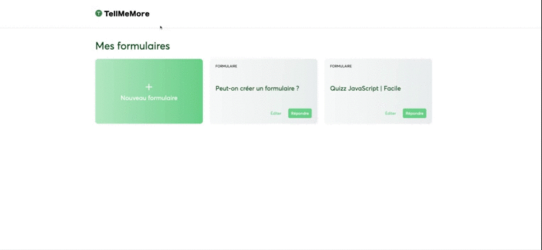

# Form Generator | React | Full-Stack

## Intro

Project descriptionForm generator developed in React | Creation of an Express server, a database and the front-end

Form management interface
Add / modify / delete a form and its associated questions in the MongDB
Deployment of the backend on Heroku and the frontend on Netlify

## Features

- Create a new form
- Modify the title of a form
- Delete a form
- Add a new question (Text or Note type)
- Modify the title of a question
- Modify the order of questions
- Delete a question
- Save changes
- Answer a form
- Switching from question to question does not change the page (the url remains the same)
- User answers are visible in the "Answers" tab of the form edition page
- The answers in the "Answers" tab are not impacted if the form questions are modified or deleted
